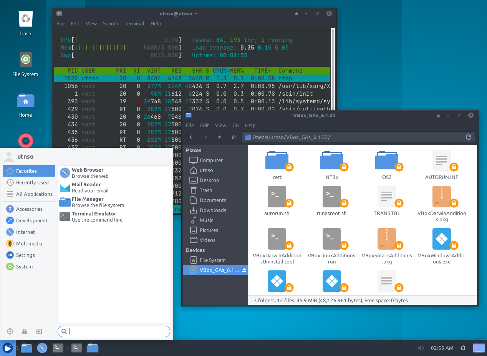

# xfce-theme

Xfce con un tema lo más parecido a GNOME posible.



1. Instalar interfaz `xfce` y reiniciar:

```bash
wget -qO- https://raw.githubusercontent.com/RaniAgus/xfce-theme/main/install.sh | bash -x
reboot
```

2. Configurar tema bonito:

```bash
wget -qO- https://raw.githubusercontent.com/RaniAgus/xfce-theme/main/configure.sh | bash -x
xfce4-session-logout --logout
```
